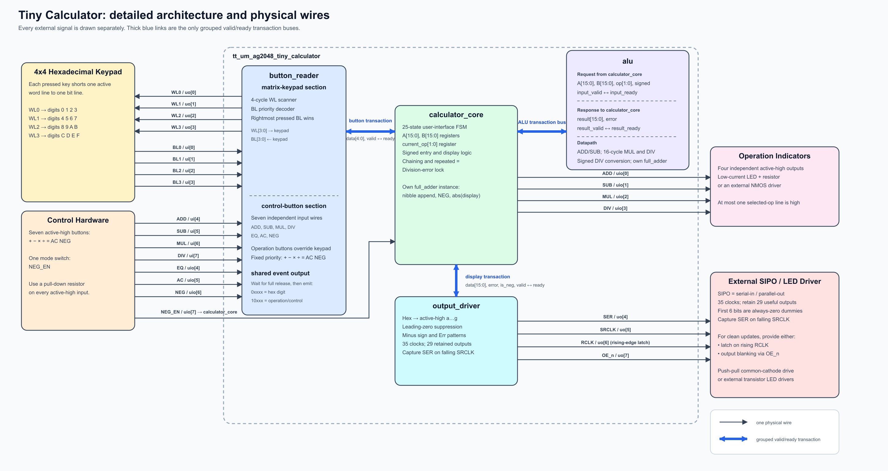
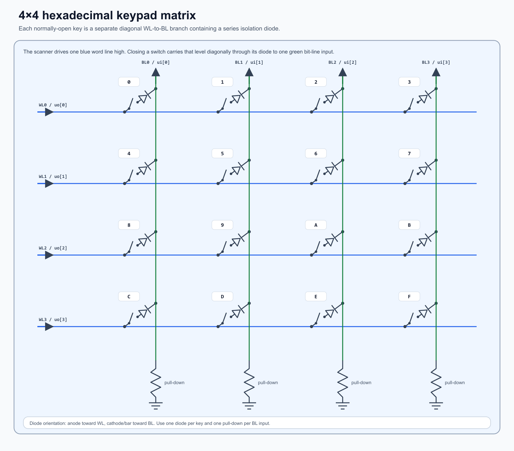

<!---

This file is used to generate your project datasheet. Please fill in the information below and delete any unused
sections.

You can also include images in this folder and reference them in the markdown. Each image must be less than
512 kb in size, and the combined size of all images must be less than 1 MB.
-->

# Tiny Calculator ASIC bring-up guide

Tiny Calculator is a manufactured 16-bit hexadecimal calculator for Tiny Tapeout. It reads a 4×4 hexadecimal keypad plus seven control buttons, performs `+`, `-`, `×`, and integer `÷`, and serializes the result for five seven-segment positions. Four additional outputs indicate the selected operation.

The calculator supports unsigned values from `0000` through `FFFF` and signed two's-complement values from `-8000` through `7FFF`. This page explains how to connect and operate the ASIC. See the [GitHub repository README](https://github.com/AG2048/tiny-calculator-asic) for its internal architecture, state machine, and arithmetic implementation.



## Before power-up

The [Tiny Tapeout SKY130 GPIOs](https://tinytapeout.com/specs/gpio/) use 3.3 V logic, are not 5 V tolerant, and are rated to source or sink 4 mA per pin. Treat 4 mA as a maximum rating, not a normal design current. Verify the electrical limits of the particular Tiny Tapeout board and external components before connecting them.

For first bring-up:

1. Connect the keypad, control buttons, mode selector, shift-register chain, displays, and their resistors before enabling the design.
2. Select Tiny Calculator at project address **546**. A standard demoboard provides its normal project-selection tooling; other boards may require manual multiplexer selection after power-up. Tiny Tapeout's [GF0p2 breakout-board guide](https://tinytapeout.com/guides/get-started-had-gf0p2/) provides one manual-selection example, but follow the procedure for the board actually in use.
3. Hold `rst_n` low while applying the clock, then release it high.
4. Start with a **5 kHz clock**. This frequency is an untested bring-up suggestion and will be revised after silicon testing. The useful rate depends on input conditioning, shift-register timing, wiring capacitance, and loading.
5. Set `NEG_EN` before entering a calculation and preferably keep it stable through that calculation.
6. Confirm `WL[3:0]`, `SER`, falling-edge `SRCLK`, rising-edge `RCLK`, and `OE_n` with a logic analyzer before attaching the displays if possible.

## Functional pin groups

The official published page appends the complete pin table from `info.yaml`. Functionally, the pins are grouped as follows:

| Group | Signals | Purpose |
| --- | --- | --- |
| Keypad inputs | `BL0`–`BL3` | Active-high matrix bit-line inputs |
| Control inputs | `ADD`, `SUB`, `MUL`, `DIV`, `EQ`, `AC`, `NEG` | Active-high push-button inputs |
| Mode input | `NEG_EN` | Low selects unsigned operation; high selects signed two's-complement operation |
| Keypad outputs | `WL0`–`WL3` | One-hot active-high matrix word-line drive |
| Display interface | `SER`, `SRCLK`, `RCLK`, `OE_n` | Serial data, shift clock, storage-latch clock, and active-low output enable |
| Operation indicators | `ADD`, `SUB`, `MUL`, `DIV` on `uio[3:0]` | Active-high selected-operation outputs |

The input and output signals with the same operation name are separate pins: for example, `ui_in[4]` is the `ADD` button input while `uio[0]` is the addition-status output.

## Electrical protection and pull-downs

All active-high inputs need a defined low level when open. A **100 kΩ pull-down** is a practical starting value for each dedicated button input, `NEG_EN`, and each BL input. Higher resistance reduces current but increases sensitivity to leakage and noise; lower resistance improves noise immunity but loads a pressed WL more heavily.

Approximately **1 kΩ of series protection** is recommended on non-LED connections to the ASIC. Choose the final value from the worst credible fault:

```text
Rseries >= 3.3 V / Isafe
```

A 1 kΩ resistor limits a direct 3.3 V short to about 3.3 mA on one pin. It does not certify that shorting many pins simultaneously is safe: twelve calculator pins can drive externally (`uo_out[7:0]` and `uio[3:0]`), so twelve independent 1 kΩ shorts could demand about 39.6 mA in total. Avoid sustained faults and use external buffers when aggregate loading is uncertain. (In extreme cases, if an incorrect project is loaded, the ASIC may drive up to 16 pins simultaneously)

Total series resistance also forms an RC network with the wiring, pin, and receiving-input capacitance. This effect is generally small at low frequencies, but verify the chosen resistance, wiring, capacitance, and clock frequency together. In the keypad path, include the WL-side resistor and any BL-side series resistor when checking the pressed voltage:

```text
VBL ~= (3.3 V - Vdiode) × Rpulldown / (Rpulldown + Rseries)
```

Verify the result against the receiving input's guaranteed `VIH`, including diode drop and component tolerances. Keeping a nominal 100 kΩ pull-down much larger than a nominal 1–2 kΩ total series path avoids the roughly 10% divider loss that a 10 kΩ pull-down would introduce with 1 kΩ of series resistance. A Schmitt-trigger buffer can restore a clean logic transition and add hysteresis after the resistor-divider node, but it cannot repair a pressed voltage below its positive-going threshold and does not provide mechanical debounce by itself.

Input pins are normally high impedance, so their series resistors should carry negligible steady current. Therefore, adding a small series resistor to input pins should be a safe way to protect the ASIC, while not affecting the logic level (due to low-to-none current draw).

## Keypad array



The keypad, switches, diodes, and pull-downs are external hardware. Each normally-open key connects one WL to one BL through a series isolation diode. Place the diode anode toward the driven WL and its cathode/bar toward BL. Give every BL its own pull-down. The diagram is illustrative and intentionally omits component values and optional protection resistors.

| Active word line | `BL0` | `BL1` | `BL2` | `BL3` |
| --- | --- | --- | --- | --- |
| `WL0` | `0` | `1` | `2` | `3` |
| `WL1` | `4` | `5` | `6` | `7` |
| `WL2` | `8` | `9` | `A` | `B` |
| `WL3` | `C` | `D` | `E` | `F` |

For each active word line, the asserted BL corresponds to the value shown at that WL/BL coordinate in the table.

The ASIC drives one WL high at a time. It can update the candidate key while buttons are held, but it emits a valid button event **only after every matrix and control button has been released for one complete four-row scan**. Holding a key therefore produces one release-latched event rather than repeated digits. This scan and release logic is **not mechanical debouncing**.

### Simultaneous buttons

Simultaneous inputs are supported. They resolve deterministically into one release-latched event according to scan order, per-row and dedicated-button priority, and release order. See the [repository README](https://github.com/AG2048/tiny-calculator-asic#multiple-simultaneous-buttons) for the exact rules.

## Input release behavior and optional debounce

The inputs are sampled synchronously on clock edges as the rows are scanned; they are not asynchronous one-shot triggers. The reader emits an event only after one complete four-row scan observes every matrix and dedicated input released. A short contact interruption that does not produce a complete released scan is therefore ignored naturally.

This is still not a designed mechanical debouncer. Mechanical bounce may span several clock edges. The relevant failure case is not simply whether bounce is faster than `clk`; it is whether sampled bounce resembles a complete released scan followed by another press. That sequence can create an early or duplicate event. Many switches and clock rates may work reliably without extra debounce, so validate the real hardware before adding it.

If testing shows incorrect or duplicate events, an RC filter followed by a Schmitt-trigger buffer is a straightforward option for each dedicated button. Calculate its thresholds and time constant from the switch bounce, intended response time, series protection, and buffer datasheet.

BL filtering needs more care. The isolation diodes prevent reverse current into inactive WLs, but a large capacitor directly from a shared BL to ground can retain a high level into a later row slot and associate the key with the wrong row. Use either:

- A small BL RC used only as a noise filter, verified to fall below `VIL` before another row can be sampled.
- Schmitt-trigger or matrix-aware conditioning that respects the row scan.
- Per-key conditioning before the matrix connection.
- A deliberately chosen and validated scan clock combined with external logic.

At the suggested 5 kHz clock, one row slot is about 200 µs and a full scan is about 800 µs. A conventional multi-millisecond debounce capacitor on a shared BL is therefore likely to remain charged across several rows. If BL filtering is needed, validate clock rate, RC timing, diode drop, series resistance, `VIH`, and `VIL` together on the real circuit.

## Operation-status LEDs

The four active-high operation outputs may directly drive low-current indicator LEDs. Start near 1 mA and calculate each resistor from:

```text
RLED = (3.3 V - VF_LED) / ILED
```

Choose the next larger standard value and remain below the ASIC pad limit. If brightness or current is a concern, use the ASIC output to drive the gate of a logic-level NMOS. Connect the NMOS source to ground and place the LED plus its current-limiting resistor between 3.3 V and the drain. The ASIC then supplies only transient gate current.

## Seven-segment shift-register interface

A **SIPO** is a Serial-In, Parallel-Out register: it accepts one `SER` bit per shift clock and presents the stored bits simultaneously on parallel output pins. The ASIC does not drive the display segments from `SER`; segment current comes from the SIPO or a separate LED-driver stage.

Use enough outputs for one sign segment plus four complete hexadecimal digits: **29 retained outputs**. Four daisy-chained 8-bit registers provide 32 outputs and are sufficient; leave the extra retained dummy outputs disconnected. The ASIC nevertheless transmits **35 bits** on every update:

```text
first sent                                                   last sent
D1a D1b D1c D1d D1e D1f D1g | D2a ... D2g | D3a ... D3g | D4a ... D4g | D5a ... D5g
```

`D1` is the leftmost/MSB display position and `D5` is the rightmost/LSB position. `D1a` through `D1f` are always-zero dummy bits. After 35 clocks, a 29-stage chain naturally discards those first six zeroes and retains this useful frame:

```text
D1g | D2a D2b D2c D2d D2e D2f D2g | ... | D5a D5b D5c D5d D5e D5f D5g
```

The minus sign uses segment `g` immediately to the left of the magnitude's most-significant visible digit. `D1g` is used when all four magnitude digits need display space; for shorter values, a later digit's `g` segment carries the sign. The six dummy outputs are always zero, including during `Err`.

The final QA/QB/… wiring order depends on the selected register's shift direction. On a typical chain the last transmitted bit remains nearest the serial input and the earliest retained bit ends farthest away, but the register datasheet—not its output naming convention alone—is authoritative. Test a one-hot frame before wiring all segments.

### Required SRCLK falling-edge capture

**Hardware erratum:** the manufactured design requires the external SIPO to capture `SER` on the **falling edge of `SRCLK`**.

`SRCLK` is normally held high and follows `clk` while a display frame is being shifted. The design assumed that a rising-edge register would capture the previous cycle's data. In physical hardware, however, `SER` and `SRCLK` are produced from the same internal clock event, so the data has no guaranteed setup time before the rising edge.

At each falling edge, `SER` has had approximately half a clock period to settle. This includes the first falling edge, when the normally-high `SRCLK` begins following the low phase of `clk`. A falling-edge SIPO therefore captures all 35 bits correctly.

Use one of these approaches:

1. A SIPO that shifts natively on a falling clock edge.
2. A proper logic inverter between ASIC `SRCLK` and a conventional rising-edge SIPO.
3. A validated NMOS-plus-pull-up inverter, provided its voltage levels, rise time, loading, and inversion are suitable.
4. A deliberately delayed `SER` path only after timing analysis proves setup and hold margins.

This was an overlooked design flaw, but the falling-edge workaround is simple and does not affect calculator arithmetic.

### `RCLK`, `OE_n`, and clean updates

- `RCLK` is the storage-latch clock after all 35 bits. Connect it to a SIPO's storage/shadow-latch clock so the completed frame is captured on the **rising edge of `RCLK`**. The old display remains stable until that edge transfers the complete frame.
- `OE_n` is high while shifting and low while displaying. Connect it to an active-low output-enable input when available so the display is blank during transfer.
- A storage latch by itself is enough to prevent intermediate patterns. `OE_n` by itself can hide shifting on a register without a storage latch. Using both is preferred.
- A register with neither feature can still receive the final frame, but intermediate patterns may visibly flash while bits move.

### Segment drive capability

For common-cathode displays, an active-high push-pull SIPO may source the segments directly only if its output-high voltage, per-pin source current, and total package current all satisfy the desired brightness with the selected segment resistors. Calculate each resistor from the SIPO supply, output drop, LED forward voltage, and chosen current.

If the SIPO cannot supply enough current, add transistor or LED-driver stages. A common-anode arrangement can use one low-side NMOS per segment: the shift-register output drives the gate, the NMOS sinks the LED current, and the segment still needs a current-limiting resistor.

## Using the calculator

Digits are hexadecimal. Chained operations execute from left to right; there is no operator precedence.

### Normal calculations

| Keys | Meaning | Result |
| --- | --- | --- |
| `1 2 + 3 =` | `0x12 + 0x3` | `15` |
| `F F * 2 =` | `0xFF × 2` | `1FE` |
| `A / 3 =` | Integer quotient; remainder discarded | `3` |
| `2 + 3 * 4 =` | First `2+3`, then `5×4` | `14` |

Pressing another operator after entering B calculates the pending operation immediately and selects the new operator. That is why chained calculations are left-to-right.

### Omitted and repeated operands

- `1 + =` uses the displayed A value as the missing B, so it calculates `1+1` and displays `2`.
- Another `=` repeats the retained operation with the retained B. Therefore `3 + = =` displays `6`, then `9`.
- `2 + 3 = * =` selects addition again and uses the displayed `5` result as the omitted second operand, so it calculates `5*5` and displays `19`.
- An operator pressed before any B digit replaces the previous operator. `2 + * 3 =` calculates `2×3`, not `2+3`.
- Combining both rules, `2 + * 3 - =` replaces `+` with `*`, calculates `2×3 = 6` when `-` is pressed, selects subtraction, then uses displayed A as omitted B: `6-6 = 0`.

### After `=`

- Pressing an operator continues from the displayed result as A. Example: `2 + 3 = * 4 =` displays `5`, then `14`.
- Pressing a digit starts a fresh calculation and discards the old A, B, and operation.
- Pressing `=` again repeats the retained operation and B.
- Pressing `NEG` toggles the displayed result in signed mode.

### `NEG` and signed input

`NEG_EN=0` selects unsigned mode; `NEG` then has no numerical effect. `NEG_EN=1` enables two's-complement signed entry and display.

- `NEG 2 * 3 =` enters negative two and displays `-6`.
- `2 NEG * 3 =` also negates A before the operator.
- `2 * NEG 3 =` prepares a negative B before its first digit.
- `2 * 3 NEG =` negates the already-entered B.
- Pressing `NEG` twice toggles back to the original sign.
- After `=`, `NEG` toggles the displayed result without starting a new calculation.

The signed-mode input is live rather than latched per calculation. Changing `NEG_EN` alone does not rewrite the already-latched display; the new interpretation appears on the next display transaction, such as a digit update, `NEG`, calculation result, or `AC`. Preferably keep `NEG_EN` stable during a calculation so later input, arithmetic, and display updates all use the same interpretation.

### Clear, errors, and limits

- Initial `=` is ignored because no operation has been selected.
- `AC` clears A, B, the selected operation, sign-entry flags, and the display value.
- Division by zero displays `Err`. Every key except `AC` is ignored until the error is cleared.
- Division truncates toward zero and discards the remainder.
- A digit that would exceed the current 16-bit signed or unsigned input range is ignored, leaving the displayed operand unchanged.
- Arithmetic results are limited to 16 bits. Add, subtract, and multiply overflow wraps modulo `2^16`; overflow is not reported as an error.

## Bring-up checklist

- Confirm 3.3 V logic and common ground; never apply 5 V to an ASIC input.
- Select project 546 following the board's project-selection procedure.
- Hold reset low, begin with the untested 5 kHz suggestion, then release reset.
- Check that one and only one WL is high at a time.
- Verify each key appears only after complete release.
- Verify `SER` on falling `SRCLK` edges before connecting the SIPO.
- Confirm 35 shift edges followed by the rising `RCLK` latch edge and `OE_n` returning low.
- Test a one-hot segment mapping and confirm all six discarded dummy bits are zero.
- Check SIPO per-pin and total current before enabling all display segments.
